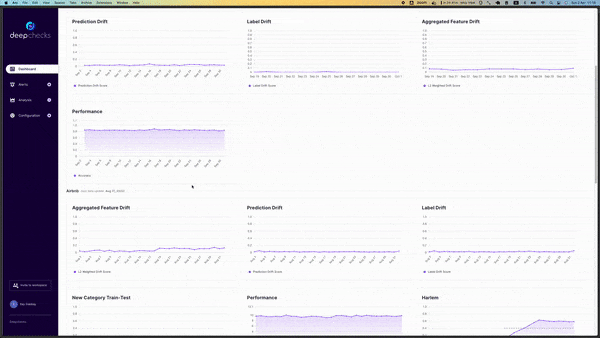

<!--
  ~ ----------------------------------------------------------------------------
  ~ Copyright (C) 2021-2022 Deepchecks (https://www.deepchecks.com)
  ~
  ~ This file is part of Deepchecks.
  ~ Deepchecks is distributed under the terms of the GNU Affero General
  ~ Public License (version 3 or later).
  ~ You should have received a copy of the GNU Affero General Public License
  ~ along with Deepchecks.  If not, see <http://www.gnu.org/licenses/>.
  ~ ----------------------------------------------------------------------------
-->

# Deepchecks Monitoring 🕵️‍♀️

<p align="center">
   
</p>

Deepchecks Monitoring is an open source service 📦 that allows you to monitor machine learning models,
get alerts when they fail and perform root cause analysis once a problem was detected.

Deepchecks has a full solution for continous ML validation. Which means that you can use the tests
from your testing and CI/CD testing suites as the base for the tests in your monitoring environment.
The [deepchecks](https://github.com/deepchecks/deepchecks) checks (which are the infrastructure of monitors) and suites
can be customized and adapted to the monitoring service.

Moreover, when you focus on an issue that requires code level analysis, you can launch the full testing
package, with the relevant data on your Python environment and continue the root cause analysis in your
"home" environment.

Deepchecks Monitoring provides a comprehensive solution for detecting data and model drift,
monitoring key performance indicators (KPIs) 📊, and alerting when anomalies are detected 🔔.

### Deepchecks Open-source deployment

Deploy a hobby instance in one line on Linux/MacOS (Windows is WIP!) with Docker:

```
/bin/bash -c "$(curl -fsSL https://raw.githubusercontent.com/deepchecks/monitoring/main/deploy-oss.sh)"
```

This will automatically download the necessary dependencies and start the application locally.
Installing our open-source service is an excellent way to test the service locally. However, this won't scale to support
real-time production usage.

## Configuration ⚙️

The DeepChecks Monitoring application can be configured by environment variables.
The configuration file .env contains settings for the data sources, models, and KPIs that should be monitored.

## Contributing 🤝

We would love to welcome new contributors that wish to help this project grow. The most helpful ways to do so are:

1. Join our [Slack community](https://deepchecks.com/slack) and talk to us!
2. Submit feature requests and bug reports by [opening a new issue](https://github.com/deepchecks/monitoring/issues/new)
3. Submit a PR (See our instructions below for [Local Development](#local-development-))

### Local Development 🛠️

The application has the following folder structure:

- [docs](docs): Contains the docs for the app
- [backend](backend): Contains the backend code
- [frontend](frontend): Contains the frontend code

Visit the README of each folder to understand more about their structure.

## Open Source vs Paid 📜

Deepchecks Monitoring open source installation is released under the AGPL 3.0. Please note there is a folder that is not used by default (see [backend/deepchecks_monitoring/ee](backend/deepchecks_monitoring/ee)) that is subject to a commercial license (see the license [here](https://deepchecks.com/terms-and-conditions)) and is packaged as part of the repository simply to support upgrading to the commercial edition without downtime.

Using premium features (contained in the `backend/deepchecks_monitoring/ee` directory) with a self-hosted instance requires a Deepchecks license. To learn more, [book a demo](https://deepchecks.com/book-demo/) or see our [pricing page](https://deepchecks.com/pricing).

Looking for a 💯% open-source solution? Check out the [Monitoring OSS](https://github.com/deepchecks/monitoring-oss) repository, which is purged of all proprietary code and features.
