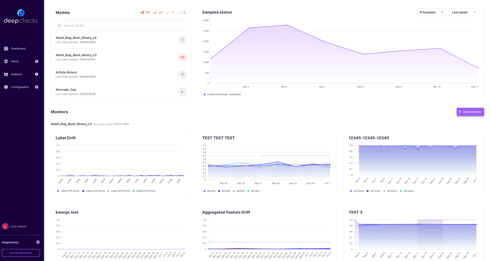

# Deepchecks Monitoring

 
<a href="https://github.com/deepchecks/mon/tree/main/frontend" target="_blank">Frontend</a>
 
<a href="https://github.com/deepchecks/mon/tree/main/backend" target="_blank">Backend</a>
 

 
